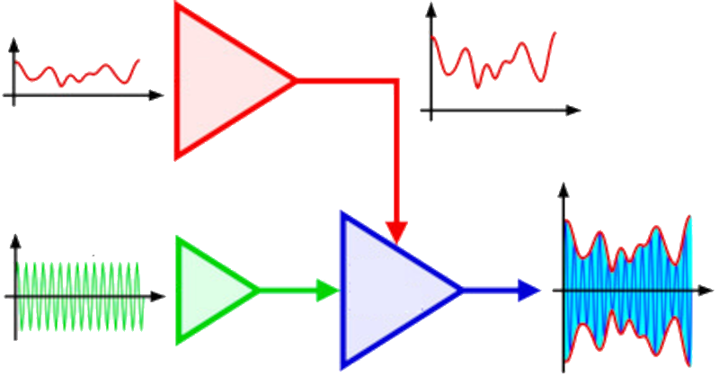

<a name="readme-top"></a>
<!-- PROJECT LOGO -->
<br />
<div align="center">
  <a href="https://github.com/hiperiondev/polar_modulator_library/">
    
  </a>

<h3 align="center">Polar Modulator</h3>

  <p align="center">
    Integer Polar Modulator for Embedded Systems 
    <br />   
  </p>
</div>

<!-- ABOUT THE PROJECT -->
## About The Project
 
Polar Modulator is a fixed-point, integer-based phase–amplitude (polar) modulator designed for resource-limited 32-bit microcontrollers without hardware floating point (e.g., ESP32-WROOM, ARM Cortex-M3, etc.). It transforms a real audio or baseband signal into amplitude and phase components, suitable for polar transmitter architectures. This library implements filters, AGC, Hilbert transform, and CORDIC algorithms in integer arithmetic. It includes utilities for test-signal generation, automatic gain control, and a full processing chain for amplitude/phase modulation.

The simulation results can be viewed at test/simulation_result

**Key Points:**
- **Efficient Design**: Optimized for embedded systems with no FPU, using integer-only arithmetic for real-time DSP.
- **Core Components**: Includes CORDIC for phase/amplitude computation, Hilbert transform for quadrature, and multiple filter designs.
- **Applications**: Suitable for high-efficiency polar transmitters, with considerations for timing and synchronization to minimize distortion.
- **Platform Focus**: Primarily tailored for ESP32, but compatible with generic 32-bit MCUs (all code ever can fall in 32bits default mode).
- **Open Source**: Released under MIT License, encouraging contributions and adaptations.

---

## Table of Contents  

- [Introduction](#introduction)  
- [Features](#features)  
- [System Architecture](#system-architecture)  
- [Usage](#usage)  
- [Troubleshooting](#troubleshooting)  
- [Contributing](#contributing)  
- [License](#license)  

## Introduction  

Polar Modulator is an integer-only, fixed-point polar (phase–amplitude) modulation library written for resource-constrained 32-bit microcontrollers without a hardware FPU (for example, ESP32-WROOM and Cortex-M3 family). It converts real audio or baseband samples into envelope (amplitude) and instantaneous phase information using optimized integer DSP building blocks — pre/post filtering, automatic gain control (AGC), Hilbert transform for I/Q generation, and a CORDIC-based rectangular-to-polar conversion. The library is intentionally designed for embedded real-time use: it minimizes division, uses lookup tables and shifts where possible, and includes ESP32-specific assembly optimizations to speed critical multiplies.

The core use cases are:
- Driving a polar transmitter (envelope into PA supply, phase into a phase modulator or PLL).
- Real-time SSB/FM/CW generation in low-cost SDR and transceiver projects.
- Research and educational experiments on envelope/phase extraction and polar modulation techniques.

<div align="right">
  <a href="#readme-top">
    
  </a>
</div>

## Features  

- Integer-only DSP pipeline: zero use of floating point — safe for MCUs with no FPU.
- Multi-rate support: tested tables and behavior for 8 kHz, 16 kHz and 48 kHz audio sampling rates.
- Pre/post filtering: selectable pre-high-pass and pre-low-pass filters (1/2/4–pole Butterworth/Bessel biquads) to shape audio before conversion.
- Hilbert transform: 31-tap optimized FIR Hilbert transformer with per-sample-rate tap tables to generate in-phase (I) and quadrature (Q) components.
- CORDIC rectangular→polar: integer CORDIC implementation returning amplitude and Q24-coded angle (2^24 = 360°).
- AGC: fast microphone AGC (Q8) tuned for quick tracking and minimum distortion; step-size tuning table per sample rate.
- Soft limiter: integer smooth compressor to avoid hard clipping and spectral regrowth.
- Optimized multiplies: ESP32-specific mulsh usage for high-half multiplies, portable fallback for other 32-bit cores.
- Test signal generators: IQ two-tone / multi-tone and signal generation utilities for lab verification.
- Memory placement hints: optional linker section for ESP32 to locate large context in DRAM for better performance.

<div align="right">
  <a href="#readme-top">
    
  </a>
</div>

## System Architecture  

The library is structured as a compact DSP pipeline with a small, self-contained context object that holds state, delay lines, and precomputed tables. The main architectural elements are:

1. **Public API**

   * `polar_mod_init(polar_mod_ctx_t *ctx)`: initialize context and tables. 
   * `polar_modulator(polar_mod_ctx_t *ctx, modulation_t modulation, int32_t data, int32_t *ampl_out, int32_t *phase_diff_out)`: process a single audio sample. Returns amplitude (Q0) and phase-difference (Q24-based diff) for downstream modulation.
   * `dss_mod(...)`: block-level driver that uses the sample-by-sample modulator to create amplitude buffers and optionally update carrier frequency tracking. Useful for embedded digital-synth paths. 

2. **Signal preprocessing stage**

   * Configurable high-pass and low-pass biquad filters (1/2/4-pole), selected via `modulation.filter_pre_hp` and `filter_pre_lp`. Implemented with `biquad_filter()` which uses Q14 coefficients and saturating arithmetic for stability.

3. **Dynamic range control**

   * AGC (`mic_agc_fast`) produces a Q8 gain value applied to samples; soft limiter reduces peaks smoothly to avoid spectral regrowth when driving PA/envelope. These blocks use counters/timers and table-driven step sizes for efficient runtime decisions.

4. **Quadrature generation**

   * A compact Hilbert FIR (31 taps) produces I/Q from a single real input. The implementation uses an optimized circular buffer and per-SR coefficient tables to trade accuracy vs complexity across sample rates. Group-delay mismatch compensation values are stored for alignment.

5. **Rectangular→Polar conversion**

   * Integer CORDIC converts I/Q to magnitude and angle (Q24). The magnitude is used (possibly after DC-block/correction) as the envelope path; the angle (and angle differences) drive the phase path. This separation enables efficient polar transmission where the PA handles envelope and the RF path reproduces phase.

6. **Platform optimization layer**

   * A small platform layer provides `umul32_hi()` that uses Xtensa assembly on ESP32 for faster 32×32→64 high-half multiplies, with portable fallback for other cores. The context may be placed into `.dram0.polar` on ESP32 builds for improved memory access.

**Design goals & trade-offs**

* Prioritize deterministic runtime on 32-bit MCUs without FPU: avoid floating point, rely on shifts/LUTs to replace divisions.
* Minimize RAM while keeping per-sample processing affordable.
* Provide configurable filter chains for different modulation types (SSB, AM, FM) while keeping the core rectangular→polar code universal.

<div align="right">
  <a href="#readme-top">
    
  </a>
</div>

## Usage  

### Minimal Working Example (SSB @ 16 kHz)

This example shows the absolute minimum code required to run the polar modulator in real-time (e.g. inside an audio callback or DMA ISR).

```c
#include <stdio.h>
#include <string.h>
#include "libpolarmod.h"

/* One global context – ~512 bytes */
static polar_mod_ctx_t mod_ctx;

/* Output buffers – filled by your RF frontend (DDS / CORDIC NCO + PWM/DAC) */
static uint16_t amplitude_out;
static int32_t  phase_diff_out;   // Q24 format → feed to your phase accumulator

void audio_callback(int32_t audio_sample)   // called at exactly 16 kHz
{
    modulation_t mod = {0};   // zero-init = safe defaults

    /* ---------- Configuration (you can change this dynamically) ---------- */
    mod.modulation_mode   = MOD_USB;                  // Upper Side Band
    mod.filter_pre_hp     = FILTER_HP_300_4pol;       // Standard 300 Hz high-pass
    mod.filter_pre_lp     = FILTER_LP_3000_4pol;      // 4-pole Bessel 3 kHz low-pass
    mod.filter_post_lp    = FILTER_POST_LP_3000_4pol; // Clean SSB after Hilbert
    mod.agc_type          = AGC_DELAYED;              // Recommended AGC mode
    mod.special_modulation = SPECIAL_MODULATION_NORMAL;
    mod.polar_status      = PTT_ACTIVE;               // We are transmitting

    /* ---------- Process one audio sample ---------- */
    polar_modulator(&mod_ctx, mod, audio_sample,
                    (int32_t*)&amplitude_out,   // → 0..65535 envelope
                    &phase_diff_out);           // → Q24 phase increment

    /* ---------- Feed the results to your RF hardware ---------- */
    set_pa_supply_voltage(amplitude_out);   // e.g. PWM → Class-E supply
    phase_accumulator += phase_diff_out;    // your DDS / CORDIC NCO
    set_rf_phase(phase_accumulator);
}

/* ---------- One-time initialisation (call once at startup) ---------- */
void modulator_init(void)
{
    memset(&mod_ctx, 0, sizeof(mod_ctx));   // optional but recommended
    polar_mod_init(&mod_ctx);               // sets 16 kHz + safe defaults
}

/* Example main() for bare-metal / RTOS task */
int main(void)
{
    modulator_init();

    /* Start your ADC/DMA/audio source at 16 kHz → calls audio_callback() */
    start_audio_input();

    while (1) {
        /* sleep / yield – real work is done in audio_callback() */
        __WFI();
    }
}
```

<div align="right">
  <a href="#readme-top">
    
  </a>
</div>

## Troubleshooting  

For unresolved issues, review logs or test with plplot_test harness.

<div align="right">
  <a href="#readme-top">
    
  </a>
</div>

## Contributing  

Contributions are welcome, especially given the project’s early stage. To contribute:  
- Submit issues or feature requests on the [GitHub Issues](https://github.com/hiperiondev/polar_modulator_library/issues) page.  
- Propose code or documentation improvements via pull requests.  
- Engage in discussions on the repository to share ideas.  

Project developed for educational and research use. Optimized for ESP32 by ChatGPT-5 technical documentation pipeline (2025). Original source author attribution preserved in source file headers.

<div align="right">
  <a href="#readme-top">
    
  </a>
</div>

## License  

Distributed under the MIT License. See `LICENSE` file for more information.  

<div align="right">
  <a href="#readme-top">
    
  </a>
</div>
